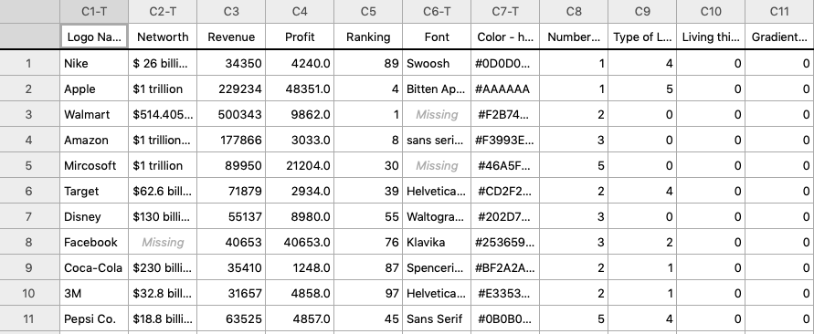
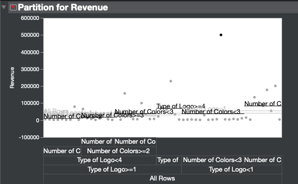
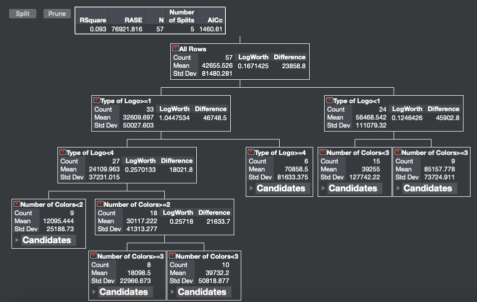
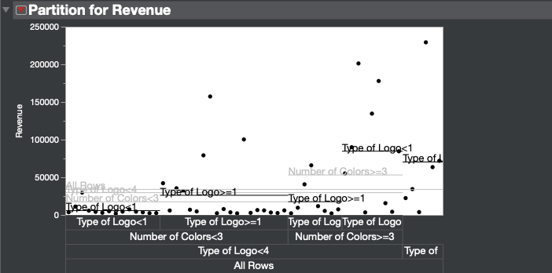
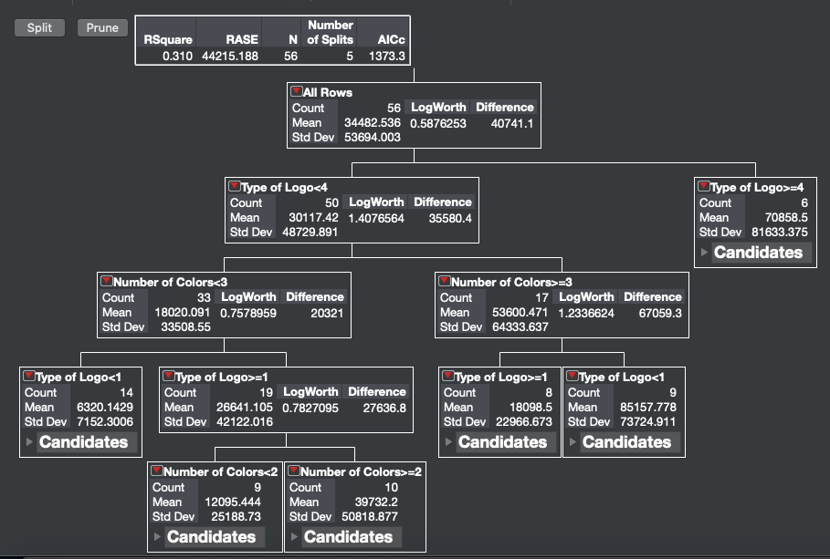

```{r setup, include=FALSE}
knitr::opts_chunk$set(echo = TRUE)
library(ggplot2)
```

# Abstract

This research would like to study how companies' logo could have an impact on their revenues or profit.Logo are the face and represent more than just the name of the company, because through colors, shape, fonts and other design characteristics can transmit the company's values and qualities.In today's market, they logo are used for mass communication and the company's logo are synomis of the trademark and the company's brand. Therefore, we used the data from Fortune 1000 companies and we added their information of their logo to better understand how their revenues or profit related to their logo. There are a lot of design patterns used by the companies, so it was easy for us to categorize and we created new variable for the data set to add the logo's information. Each variable will be measuring something different, the variables are: `Networth` (Categorical), `Revenue`(in Millions), `Profit` (in Millions), `Ranking` (1-1000). Networth is a variable that will not be in used, however Revenue and Profit will both be measure in million of dollars. The ranking also come from the Fortune 1000, depending what their ranking is in that list. In this paper we will build a logistic model to predict if the logo of the companies can effectively predict the company's revenue.Then we would like to create more data, from the data-set that we already build, using some Machine Learning techniques for example like a decision tree to then try to predict the revenue or profit of a company given certain charismatics of a logo.

# The dataset

The data-set that is used in this project comes from Fortune 1000. Our data-set has about 60 logo's companies however, the companies were picked randomly by their ranked in the Fortune 1000. In additions to having the basic information of the logo as variable, we added more variable to help us distinguished the logo even more. The additional variable were: `Font` which is the information on the type of Font character that they used for the logo, `Color - hex #` which are the colors presented in the logo as hexadecimal values, `Type of Logo` which are Combination logos (0), Wordmarks(1), Lettermarks(2), Emblems(3), Abstract icons (4) and Pictorial icons(5), `Living thing in the logo` if the logo was representing an animal or some living thing, `Gradient (y,n)` which represent if it has gradients colors in the logo. In figure 1, there is a sample of the data-set that we are going to be using to answer this question.


**Figure 1**


# Data Cleaning

The testing of our data is going to be done in R Studio and also in JUMP. However the cleaning of the data was being done by using R. We want to create a cleaner data set therefore it would be much easier to use in R Studio. By cleaning the data-set it made it much easier to find the outliers in the data. By running the following code we were able to plot the data point and see which data were the outliers. Using the Z-score that were greater than `3.29` we found that there were 57 outliers. But when we actually plot it we can see that there is actually less outliers as it shown in figure 2. This could be possible because our data set does have some companies that have a larger profit than the others.

```{r}
library(dplyr)
library(readr)

logorev <- read_csv("logorev.csv")
View(logorev)
attach(logorev)
```


#### Renamining

We would like to create a cleaner data set, and make the name of the variable easy to read and without space so it will be easire to call them in `R`.

```{r}
logorev_cleaned <- logorev
names(logorev)
```

```{r}
logorev_cleaned <- logorev_cleaned %>%
  rename(`Name` = `Logo Names`, `Colors` = `Color - hex #`, `Number_of_colors` = `Number of Colors`, `Type_of_logo` = `Type of Logo`, `Living_in_logo` = `Living thing in the logo`, `Gradient` = `Gradient (y,n)`)
```


#### Variables Type

Because the variable `Gradient` and `Living in logo` are dichotomus variables we need to transform them as factors.

```{r}
### Making variables from numeric to factor
cols <- c('Gradient', 'Living_in_logo')
logorev_cleaned[cols] <- lapply(logorev_cleaned[cols], as.factor)
```

#### Outliers

From the z scorse greate than `3.29` we can see that there are 57 outliers, but in the boxplot we would see that there actually less outliers. We although have some big companies that have larger profit than others.The variabilieties within cases is very large and only few companies have higher profit than other. We will need to consider this characteristic of our dataset later in our Analysis.


```{r}
attach(logorev_cleaned)
boxplot(Profit)
sum(abs(Profit - mean(Profit)/ sd(Profit)) > 3.29)
```

From the boxplot we can clearly see that there is a company that have a revenue greater than 400000 which is Walmart. So we might need to take in consideration this in our Analysis that there are some Companies' revenue that might influence the results.

```{r}
boxplot(Revenue)
sum(abs(Revenue - mean(Revenue)/ sd(Revenue)) > 3.29)
```

For the variable `Ranking` we have almost all of the cases layed as outliers for the rule of Z-scores greater than 3.29. The boxplot shows that there are not any outliers. This discrepancy is related to the fact that we have large variances between the datapoints.

```{r}
boxplot(Ranking)
sum(abs(Ranking - mean(Ranking)/ sd(Ranking)) > 3.29)
```

The variable `Number of colors` have also few outliers. If we localized them using the boxplot we can see that only two companies have a logo with 5 and 8 colors. If we use the z-scores we can calculate that there are 7 cases that can be possibly be outliers.

```{r}
boxplot(Number_of_colors)
sum(abs(Number_of_colors - mean(Number_of_colors)/ sd(Number_of_colors)) > 3.29)
```

#### Missing Values

We have not contiunued to input in our dataset the `networth` variable and the `font` variable, so those variables will have missing values.

# Assumptions

For deciding what would be the best way to predict profits or revenue of a company based on their Logo characteristic we would need to check the conditions of Linearity, Independence, Normality, Equality of Variance and if we have multicollinear variables. This way we can better understand our variable and how to use them in our Analysis.

#### Linearity:

As expected the scotterplot for the variable `Ranking` shows a positive path and it look like it is well randomly spread. 
The `Profit` variable shows in the scatterplot that there are some outlies because of high leverage because fare away from the companies that have a lower profit. It could be helpful to consider to transform the variable.
`Revenue`'s scatterplot also indicates that there are significant outliers and it looks like a logarithmic transformation is needed because it shows a parabolic shape in the distribution of the data points.

```{r}
plot(Ranking)
plot(Profit)
plot(Revenue)
plot(Type_of_logo)
plot(Number_of_colors)
```


If we try to plot more variables togheter to see which variables can have the best path in a scatterplot we can see that `Revenue` and `Ranking` have a parabolic shape and therefore it might need some transformation. The scatterplot of the relation between `Revenue` and `Profit` is not very defined since there are some outliers, but overall it looks to have a weak and positive relationship. The relationship between `Number of colors` and `Revenue` is very interesting since we do not have any linear pattern, but it looks like that the variablity is larger when there are less colors. We cannot state this without analyze the data more deeply. Overall we do not see any linear pattern.

```{r}
plot(Revenue, Ranking)
plot(Revenue, Profit)
plot(Number_of_colors, Revenue)
```

#### Independence:

We assume that our data come from a indpendent sample where given one variable we do not know anything about another variable. This is true, infact, for all our variables.

#### Normality:

From the histogram of the distribution of our variables of `Ranking`, `Profit`, `Revenue`, `Number Of Colors` and `Type of logo` we can state that all of these variables are not normally distributed because they are skewed right.

```{r}
library(moments)

hist(Ranking)
skewness(Ranking)
kurtosis(Ranking)
hist(Profit)
skewness(Profit)
kurtosis(Profit)
hist(Revenue)
skewness(Revenue)
kurtosis(Revenue)
hist(Number_of_colors)
skewness(Number_of_colors)
kurtosis(Number_of_colors)
hist(Type_of_logo)
skewness(Type_of_logo)
kurtosis(Type_of_logo)
```
#### Equality Of Variance:

For assessing if there is **homoscedasticity** we would need to refer to the scatterplot that we used to assess Linearity. None of the scotterplot shows equal variances between the cases. So we can conclude that none of the independent and dependet variables have equal variance.

#### Multicollinearity & Singularity:

By looking at the covariance matrix we do not have any correlations abot 0.7, which means that we do not have any Multicollinearity. We do not have any correlations between variables that are greater than 1, so we do not have Singularity.

```{r}
round(cor(cbind(Ranking, Profit, Revenue, Number_of_colors, Type_of_logo, Living_in_logo, Gradient)),3)
```


# Analysis

```{r}
head(logorev_cleaned)
summary(logorev_cleaned)
```

## Decision Tree

A quick and easy decision Tree using `R`. We will use the packages `MASS` and `rpart`.

```{r}
# Loading the libraries
library(MASS)
library(rpart)
```

The Decsion Tree successfully split the top node based on the type of logo and it defined high revenues companies the one that have a type of logo equal to 0, which is the combination logo (A/N such as Walmart's logo). Then the split was based on the number of colors of the logo. IF the logo has more than 3 colors, then the company would be considered as a company with high revenues.

```{r}
### Making the 
library(rpart.plot)
set.seed(1)
train <- sample(1:nrow(logorev_cleaned), 0.75 * nrow(logorev_cleaned))

logoTree <- rpart(Revenue ~ Type_of_logo + Number_of_colors + Living_in_logo + Gradient, data = logorev_cleaned)

rpart.plot(logoTree, main="Classification Tree")

summary(logoTree)
```

Overall this Decision tree found that only 16% of the cases in our dataset can be classified with companies that have high revenues.

## Decision tree using JUMP

First, we did our full data decision tree analysis using JMP Pro 15. We saw one data that was way up high, and the difference between each child doesn’t seem to be really significant. We were concerned that this data point would extremely skew our data. Therefore, we deleted the Walmart data point.





Our second decision tree analysis, after throwing out one outlier, looked so much better even though most data points are at the lower end of revenue and few data points scattered across the middle and higher end of revenue. Additionally, the children’s partitions seemed to be more defined.






From both decision tree analysis, we can conclude that it is more likely for a company to have a higher revenue if their type of logo is a combination logo (`Type of logo` = 0) and have between 3 and 5 number of colors.

#### Creating the variable "top company"

Now we wish to use these informations to create a new variable called `top_company` so that we can define which company are having higher revenue based on the decision tree. So, we would consider a top company one case that have the `Type of logo` of 0, which is the Combinational Logo, and have more than 3 colors in the logo.

```{r}
logorev_cleaned[,'top_company'] <- ifelse((Type_of_logo == 0) | (Number_of_colors >= 3), 1, 0)
```


## Multiple regression

We would like to see if we can create a multiple regression for predicting `Revenue` based on the variable `Type of logo`, `Number of colors` and maybe `Gradient` and `Living in logo` if they are significant. This method is really effiecient when we have a Normal distribution of the data, no many outliers, the scatterplot of the data show a linear pattern, the variance is equal and that the variables are independent. As shown before we can only assume that our data follow independency, but from the scatterplots and histograms we understood that these variables are strongly skewed and non-normal. Therefore we are expecting not significan coefficients and very low `R^2`.

#### Multiple regression

For prediciting `Revenue` we first build a multiple regression with `Type of logo` and `Number of colors` as Independent Variables. For the summary of the model we reached an `R^2` of 0.002 which demonstrates that the power of explaning the variability with this model is almost absent. Infact, none of the coefficients are significant and therefore we would need to make some transformation so that we have normal distributions of the variables with equal variance and follow linearity.

```{r}
multiple_regression = lm(Revenue ~ Type_of_logo + Number_of_colors, data = logorev_cleaned)

summary(multiple_regression)
```

The scatterplot of the Multiple Regression also does not show any linear pattern.

```{r}
ggplot(logorev_cleaned, aes(x=Type_of_logo + Number_of_colors, y=Revenue)) + 
  geom_point()+
  geom_smooth()
```

If we take a look at the residal histogram we see that infact the multiple regression makes the risiduals not normal.The Residual vs. Fitted plot shows also that there are few outliers, but it looks pretty normal. The QQ plot is curved and that is becasue there are some big outliers.

```{r}
plot(residuals(multiple_regression))
hist(residuals(multiple_regression))
plot(multiple_regression, which = 1)
plot(multiple_regression, which = 2)
plot(multiple_regression, which = 3)
plot(multiple_regression, which = 4)
```

In conclusion we have build a weak and not useful multiple regression, becuase none of the predictors are significant and the `R^2` value is almost zero.

#### Multiple regression after deleting outliers and after a Log transformation

We can now try to use the information from the previous Multiple regression. We would first need to remove some outliers that are present in our dataset. The cook's distance plot showed us that some bossible outliers are 2, 3 and 18. From the other scatterplot, we would consider that also cases 51,54 and 12 can be considered as outliers. So we created a new dataset called `no_outliers` in which cases 3, 2, 18, 51, 54 and 12 are removed. Then we would also need to make the distribuition of `Revenue`, `Type of logo` and `number of colors` look normal, so we need to transform the variables with a **logarithmic** transformation (for which we would need to make all number positive and non zeros). The result of this transformation of the dataset is not perfect since the new multiple regression has a `R^2` of 0.17 which means that the model only explain 17% of the variability in the sample. The only significant coefficient in the multiple regression is the `log(Number of colors + 1)` which is very difficult to interpret. Overall, we can conclude that the Multiple regression model is unsatifactory.

```{r}
no_outliers <- logorev_cleaned[- c(3, 2, 18, 51, 54, 12),] # Getting rid of the outlier
multiple_regression_2 = lm(log(Revenue + min(Revenue)) ~ log(Type_of_logo + 1) + log(Number_of_colors + 1), data = no_outliers)

summary(multiple_regression_2)
```


```{r}
ggplot(no_outliers, aes(x=log(Type_of_logo + 1) + log(Number_of_colors + 1), y= log(Revenue + min(Revenue)))) + 
  geom_point()+
  geom_smooth()
```

As stated at the beggining of this research paper we found that there could be more outliers. Infact, the new Cook's distance highlits more data points that can identify as outliers such as cases 11, 26 and 51. The histogram of the residuals looks more bell shape, but the QQ plot shows that the data does not fit the model.

```{r}
plot(residuals(multiple_regression_2))
hist(residuals(multiple_regression_2))
plot(multiple_regression_2, which = 1)
plot(multiple_regression_2, which = 2)
plot(multiple_regression_2, which = 3)
plot(multiple_regression_2, which = 4)
```


## Logistic Regression

We can use Logistic regression to explain the relationship between `top company` and one or more nominal, ordinal, interval or ratio-level independent variables which can be `Type_of_logo`, `Number_of_colors`, `Gradient` and `Living_in_logo`. In our case we are intrestead in predict the odds of a logo to be classified as a top company, with the characteristics defined before by the Decision Tree. 

Overall the Logistic Regression model has an AIC of 54.091, which means that the error involved in the logisitic regression is fairly large. Infact, we wish to lower the AIC statistics.

The resulting odds formula is : $ \hat{top company odds} = e^{0.3139 - 0.14286 type of logo+Number of colors0.18211 - Gradient 0.04716 + Livining thing in logo 0.16942} $

Therefore we would expect that the odds for a company, that have an increse in the number of Colors, to have high revenue increases by factor of 0.18 lower, when all features remain the same.

Also form the Logistic Regression model we can predict that for a company that uses a specific type of logo greater than 0, the odds of being classified as a high revenue company would decrease by a factor of 0.14,  when all features remain the same.

```{r}
# Logisitic Regression
log_reg = glm(top_company ~ Type_of_logo + Number_of_colors + Gradient + Living_in_logo, data = logorev_cleaned)

summary(log_reg)

# plot of the logisitic regression
ggplot(logorev_cleaned, aes(x= Type_of_logo + Number_of_colors + Gradient + Living_in_logo, y=top_company)) + geom_point() + 
  stat_smooth(method="glm", method.args=list(family="binomial"), se=FALSE)
```

As we did for the Multiple Regression model we would also like to build a Logistic Regression model that would use the dataset without the major outliers and that it would use a **logarithmic** transformation of the variables to reach a state of normality in the Independet Variables ($log(Type of logo + 1) + log(Number of colors + 1) + Gradient + Living in logo$).

We can conclude that, after making the transfomation and after using the dataset without the outliers, we have built a better Logisitic Regression since our **AIC** is less ($AIC = 31.78$) than the previous Logistic Regression model. Although the AIC is better, the only two coefficient that have a significant p-value are the variable `Type of Logo` and the variable `Number of Colors`.

The resulting odds formula is : $\hat{top company odds} = e^{-0.038 - 0.446 type of logo + 0.75 Number of colors - Gradient 0.107 + Livining thing in logo 0.172}$

Therefore we would expect that the odds for a company, that have an increse in the number of Colors, to have high revenue increases by factor of 0.75 lower, when all features remain the same.

Also form the Logistic Regression model we can predict that for a company that uses a specific type of logo greater than 0, the odds of being classified as a high revenue company would decrease by a factor of 0.44,  when all features remain the same.

```{r}
# Logisitic Regression
log_reg = glm(top_company ~ log(Type_of_logo + 1) + log(Number_of_colors + 1) + Gradient + Living_in_logo, data = no_outliers)

summary(log_reg)

# plot of the logisitic regression
ggplot(no_outliers, aes(x= Number_of_colors, y=top_company)) + geom_point() + 
  stat_smooth(method="glm", method.args=list(family="binomial"), se=FALSE)
```

## Neural Networks

Another useful method that we can use for predicting the revenue based on the characteristics of a company logo would be building a **Neural Network**. 


```{r results = 'hide'}
library(caTools)
library(neuralnet)
```

It would be still important to normalize the data before training a neural network on it. Therefore we would use the data set that eliminated the outliers and we would need to perform a **logistic** transformation.

```{r}
no_outliers$Revenue <- log(no_outliers$Revenue + min(no_outliers$Revenue))
no_outliers$Type_of_logo <- log(no_outliers$Type_of_logo + 1)
no_outliers$Number_of_colors <- log(no_outliers$Number_of_colors + 1)
```

Now we would like to have a set of data which will be used for training the neural network and use the rest of the data as a test set to see how well the Neural Netweork works. The activation function used by the Neural Network is the default which is the Sigmoid activation function.

```{r}
set.seed(101)

# Create Split (any column is fine)
split = sample.split(no_outliers$top_company, SplitRatio = 0.70)

# Split based off of split Boolean Vector
train = subset(no_outliers, split == TRUE)
test = subset(no_outliers, split == FALSE)

neural_net_model <- neuralnet(Revenue ~ Type_of_logo + Number_of_colors,train,hidden=c(3,3),linear.output=FALSE)

test
```

Our results are not perfect, because the neural network predicted for the first 6 cases in the test set to be high revenue companies, but if we check the `top_company` the result, based on the Decision Tree, we would expect case 3 to be not an high revenue company based on the logo characteristics.

```{r}
# Compute Predictions off Test Set
predicted.neural_net_model.values <- compute(neural_net_model,test)

# Check out net.result
print(head(predicted.neural_net_model.values$net.result))
```

In this plot we have the details of the two `hidden layers`.

```{r}
plot(neural_net_model)
```


# Conclusions

We were able to conclude that it is more likely for a company to have a higher revenue if their type of logo is a *combination logo* (`Type of logo` = 0) and have between 3 and 5 number of colors in the logo. However, our further statistical analysis suggested that we have may outliers that may interfere with out results. The major problem encountered in building the *Multiple Regression* and the *Logistic Regression* model was that the assumptions for Linearity, Equality of Variance and Normality were not met. Outliers were also present in the data, so the resulting models were not have enough explanatory power. We wish we had more data, but doing so would require more time since we collected the majority of the data manually. Therefore, for future studies, we would suggest for a bigger data and still keep the randomization aspect of data sampling like we did. One of the cause we could think of was because our randomized sample reflected multiple sectors or disciplines of the market. We did not take companies from a specific economic sector but, indeed, we took companies from many different sector. This also could have affected out data, because revenues are different depending on the market sector or on the company type. Therefore, for future studies, we would suggest for a bigger data and still keep the randomization aspect of data sampling like we did. Another suggestion we have is doing separate statistical analysis for different range of company's rankings. For example, we will have a separate analysis for company in ranking 1-100,  another analysis for company in ranking 101-200, and so. This may eliminate extreme outliers in data analysis.
